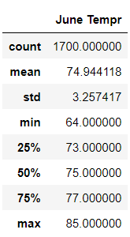
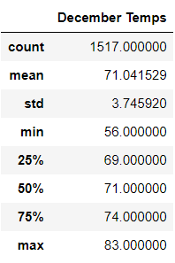

# surfs_up

## Overview of Analysis
The purpose of this Analysis is Creating Tempereture statistics  on Oahu for June and December , to make sure that the surf and ice cream shop Buisness is  sustinable year-round, it is done  By running queris ,Once our dataframe is created we are able to get our summary statistics by using the .describe() method  to retrieve information such as Average, Maximum and Minimum Temperatures for the months June and December 

## Results

## June Analysis

 

In June  total count of 1700, mean of 74.9, min of 64.0 and max of 85.0  as Oahu weather does not seem to fluctuate significantly. Based on the analysis

## December Analysis

 

In December a total count of 1,517 observation, mean of 71.0, min of 56.0 and max of 83.0 This means that some temperature recordings is missing June and December are similar in
Average , Maximum and Minimum temerature 

## Summary
We can tell By comparing the static summery  the Temperatures patterns seems steady  in Oahu  the surf and ice cream shop business will remain sustinable year-round
If we are able to gain more data to make sure we have to run Additional queries  to know the population of Oahu and What natural disasters occurs in Oahu ? to descide the location of the shop approximetely how many visitors per day will have 
